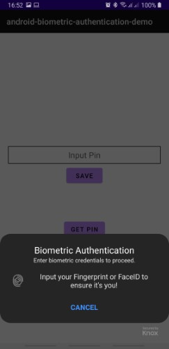
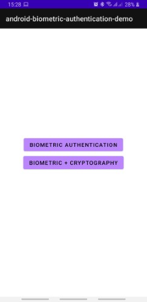
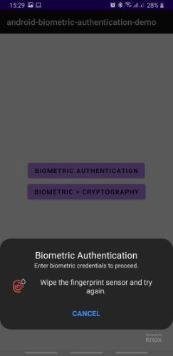
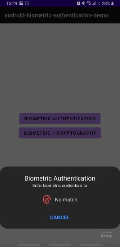
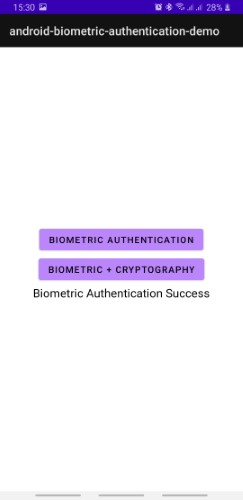
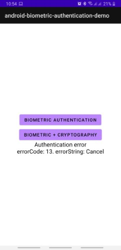
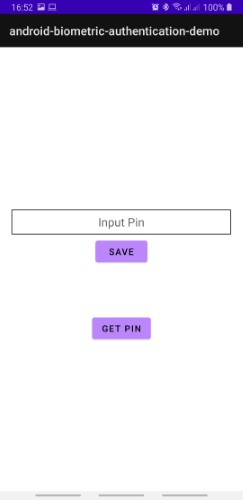
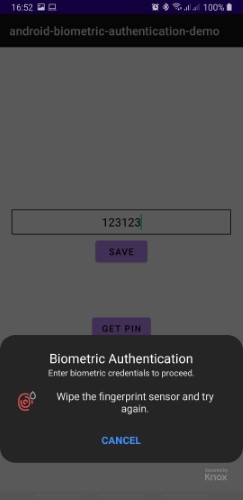
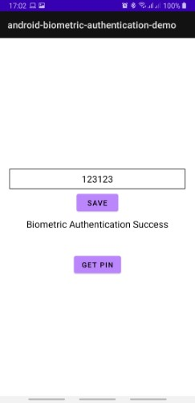
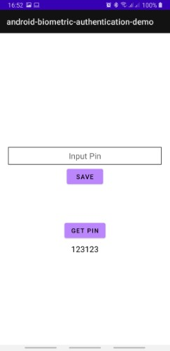

# Android Biometric Authentication Demo App
This is Demo repo for biometric authentication demo app

Table of Contents:
1. [Application](#application)
2. [Biometric Authentication](#biometric-authentication)
3. [How to Setup Biometric](#how-to-setup-biometric)
4. [Cryptography with Biometric](#cryptography-with-biometric)
5. [Encryption using Biometric](#encryption-using-biometric)
6. [Decryption using Biometric](#decryption-using-biometric)

# Application

   

The application required device with biometric capability.

It will hide all the button if the device don't have biometric capability.

The application consists of 2 page:
1. First page is a simple login using biometric authentication
2. Second page is store and get pin using cryptography with biometric authentication

# Biometric Authentication



- This is a simple login using biometric authentication.
- When the user press the `BIOMETRIC AUTHENTICATION` button, a biometric prompt will appear


- After user input the correct biometric, then the result will be shown under it

- Failed result

   

- Success result



- Error result



# How to Setup Biometric

When the app started, we need to check the biometric capability:
```
fun hasBiometricCapability(
    context: Context,
    authenticators: Int = BiometricManager.Authenticators.BIOMETRIC_STRONG
): Int {
    val biometricManager = BiometricManager.from(context)
    return biometricManager.canAuthenticate(authenticators)
}

fun isBiometricReady(
    context: Context,
    authenticators: Int = BiometricManager.Authenticators.BIOMETRIC_STRONG
) = hasBiometricCapability(context, authenticators) == BiometricManager.BIOMETRIC_SUCCESS
```

When the user press the login button, show the biometric prompt:
```
fun showBiometricPrompt(
    activity: AppCompatActivity,
    listener: BiometricPrompt.AuthenticationCallback,
    cryptoObject: BiometricPrompt.CryptoObject? = null
) {
    //Create Prompt Info
    val promptInfo = createBiometricPromptInfo()

    //Biometric Prompt
    val executor = ContextCompat.getMainExecutor(activity)
    val biometricPrompt = BiometricPrompt(activity, executor, listener)

    //Authenticate
    biometricPrompt.apply {
        if (cryptoObject == null) {
            authenticate(promptInfo)
        } else {
            authenticate(promptInfo, cryptoObject)
        }
    }
}
```

Don't forget to setup the callback in the Activity:
```
private val biometricCallback = object : BiometricPrompt.AuthenticationCallback() {
    override fun onAuthenticationError(errorCode: Int, errString: CharSequence) {
        super.onAuthenticationError(errorCode, errString)
        ...
    }

    override fun onAuthenticationFailed() {
        super.onAuthenticationFailed()
        ...
    }

    override fun onAuthenticationSucceeded(result: BiometricPrompt.AuthenticationResult) {
        super.onAuthenticationSucceeded(result)
        ...
    }
}

```

You can find most of the biometric code inside [BiometricUtil.kt](app/src/main/java/com/linecorp/id/research/biometricdemo/util/BiometricUtil.kt)

# Cryptography with Biometric



This page can be accessed by press the `BIOMETRIC + CRYPTOGRAPHY` button.

This page consist of 2 part:
1. Encrypt and Store the Pin

- Input the Pin and press the `SAVE` button, the biometric prompt will appear



- After the biometric is success, the message will be encrypted and stored inside `SharedPreference`



3. Get and Decrypt the Pin

- Press the `GET PIN` button, the biometric prompt will appear


- After the biometric is success, the encrypted message from `SharedPreference` will be decrypted and shown



# Encryption using Biometric
To encrpyt the message using biometric, first we need to create the encryption cipher using secret key
```
fun getOrCreateSecretKey(keyName: String): SecretKey {
    //Get keystore
    val keyStore = KeyStore.getInstance(ANDROID_KEYSTORE)
    keyStore.load(null) // Keystore must be loaded before it can be accessed

    //Get secret key based on keyName
    keyStore.getKey(keyName, null)?.let { return it as SecretKey }

    //Generate keygen parameter
    val paramsBuilder = KeyGenParameterSpec.Builder(
        keyName,
        KeyProperties.PURPOSE_ENCRYPT or KeyProperties.PURPOSE_DECRYPT
    )
    paramsBuilder.apply {
        setBlockModes(ENCRYPTION_BLOCK_MODE)
        setEncryptionPaddings(ENCRYPTION_PADDING)
        setKeySize(KEY_SIZE)
        setUserAuthenticationRequired(true) //For biometric
    }

    //Generate keystore
    val keyGenParams = paramsBuilder.build()
    val keyGenerator = KeyGenerator.getInstance(
        KeyProperties.KEY_ALGORITHM_AES,
        ANDROID_KEYSTORE
    )
    keyGenerator.init(keyGenParams)

    //Return new secret key
    return keyGenerator.generateKey()
}

fun getCipher(): Cipher {
    val transformation = "$ENCRYPTION_ALGORITHM/$ENCRYPTION_BLOCK_MODE/$ENCRYPTION_PADDING"
    return Cipher.getInstance(transformation)
}

fun getInitializedCipherForEncryption(): Cipher {
    val cipher = getCipher()
    val secretKey = getOrCreateSecretKey(SECRET_KEY_NAME)
    cipher.init(Cipher.ENCRYPT_MODE, secretKey)

    return cipher
}
```

Then we create `CrytoObject` from `BiometricPrompt` using encrpytion cipher and pass it into `BiometricUtil` to show the biometric prompt
```
private fun showBiometricPromptToEncrypt() {
    if (binding.editTextPin.text.toString().trim().isEmpty()) {
        Toast.makeText(this, "Pin must be filled", Toast.LENGTH_SHORT).show()
        return
    }

    //Create crypto object
    val cryptoObject = BiometricPrompt.CryptoObject(
        CryptographyUtil.getInitializedCipherForEncryption()
    )

    BiometricUtil.showBiometricPrompt(
        activity = this,
        listener = encryptBiometricCallback,
        cryptoObject = cryptoObject
    )
}
```

When the biometric authentication is success, then we will encrypt the pin into [EncryptedMessage.kt](app/src/main/java/com/linecorp/id/research/biometricdemo/data/EncryptedMessage.kt) and store it using [PreferenceUtil.kt](app/src/main/java/com/linecorp/id/research/biometricdemo/util/PreferenceUtil.kt)
```
private fun encryptAndSave(plainTextMessage: String, cipher: Cipher) {
    val encryptedMessage = CryptographyUtil.encryptData(plainTextMessage, cipher)

    //Save to shared preference
    PreferenceUtil.storeEncryptedMessage(
        applicationContext,
        prefKey = PIN_KEY,
        encryptedMessage = encryptedMessage
    )
}
```

You can find most of the cryptograhpy code inside [CryptographyUtil.kt](app/src/main/java/com/linecorp/id/research/biometricdemo/util/CryptographyUtil.kt)

# Decryption using Biometric

To decrpyt the stored [EncryptedMessage.kt](app/src/main/java/com/linecorp/id/research/biometricdemo/data/EncryptedMessage.kt), first we need to create the decryption cipher by passing the `initializationVector` from `EncryptedMessage`
```
fun getInitializedCipherForDecryption(
    initializationVector: ByteArray? = null
): Cipher {
    val cipher = getCipher()
    val secretKey = getOrCreateSecretKey(SECRET_KEY_NAME)
    cipher.init(
        Cipher.DECRYPT_MODE,
        secretKey,
        GCMParameterSpec(KEY_SIZE, initializationVector)
    )

    return cipher
}
```

Then we create `CrytoObject` from `BiometricPrompt` using decrpytion cipher and pass it into `BiometricUtil` to show the biometric prompt
```
private fun showBiometricPromptToDecrypt(encryptedMessage: EncryptedMessage) {
    //Create crypto object
    val cryptoObject = BiometricPrompt.CryptoObject(
        CryptographyUtil.getInitializedCipherForDecryption(
            encryptedMessage.initializationVector
        )
    )

    BiometricUtil.showBiometricPrompt(
        activity = this,
        listener = decryptBiometricCallback,
        cryptoObject = cryptoObject
    )
}
```

When the biometric authentication is success, then we will get the [EncryptedMessage.kt](app/src/main/java/com/linecorp/id/research/biometricdemo/data/EncryptedMessage.kt) and decrypt it
```
private fun getAndDecrypt(cipher: Cipher): String {
    val encryptedMessage = PreferenceUtil.getEncryptedMessage(
        applicationContext,
        PIN_KEY
    ) ?: return ""

    return CryptographyUtil.decryptData(
        encryptedMessage.cipherText,
        cipher
    )
}
```

You can find most of the cryptograhpy code inside [CryptographyUtil.kt](app/src/main/java/com/linecorp/id/research/biometricdemo/util/CryptographyUtil.kt)

# Contributors

- [@ferryyuwono](https://github.com/ferryyuwono)
- [@aldoKelvianto](https://github.com/aldoKelvianto)
